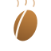
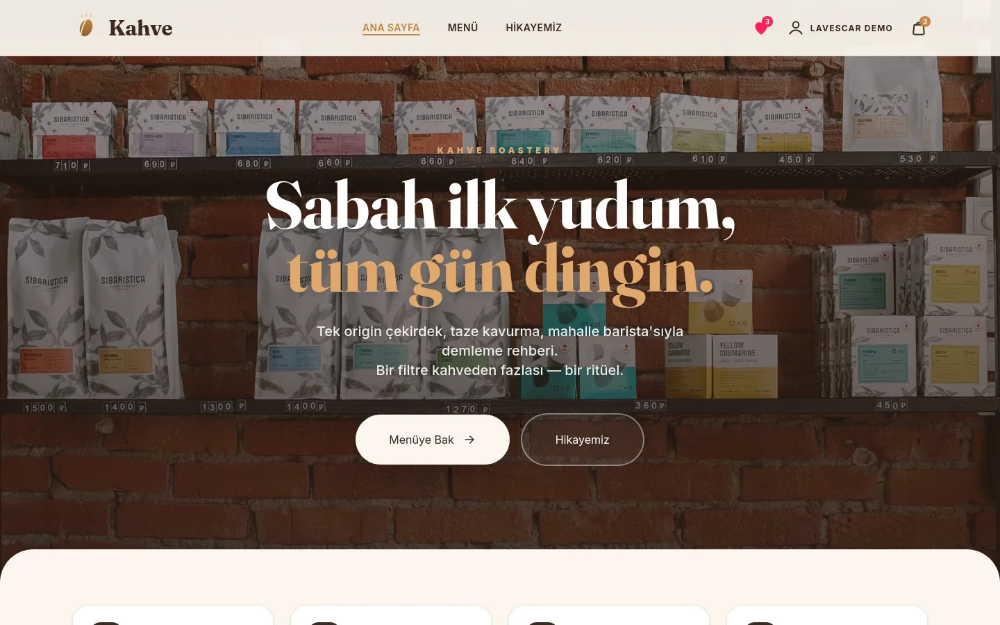
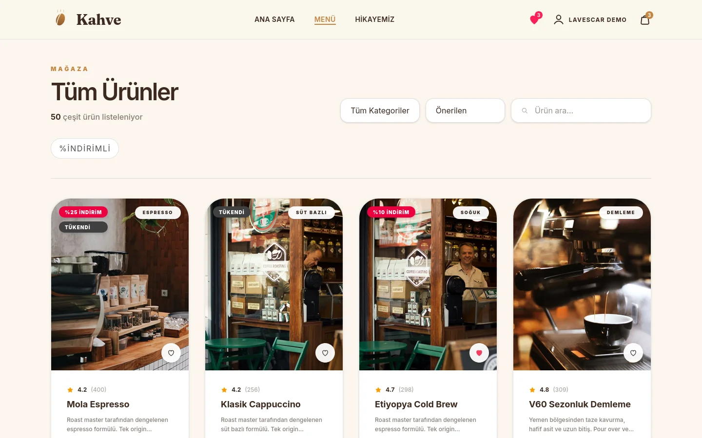
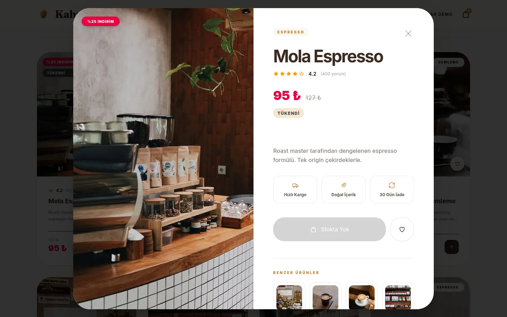
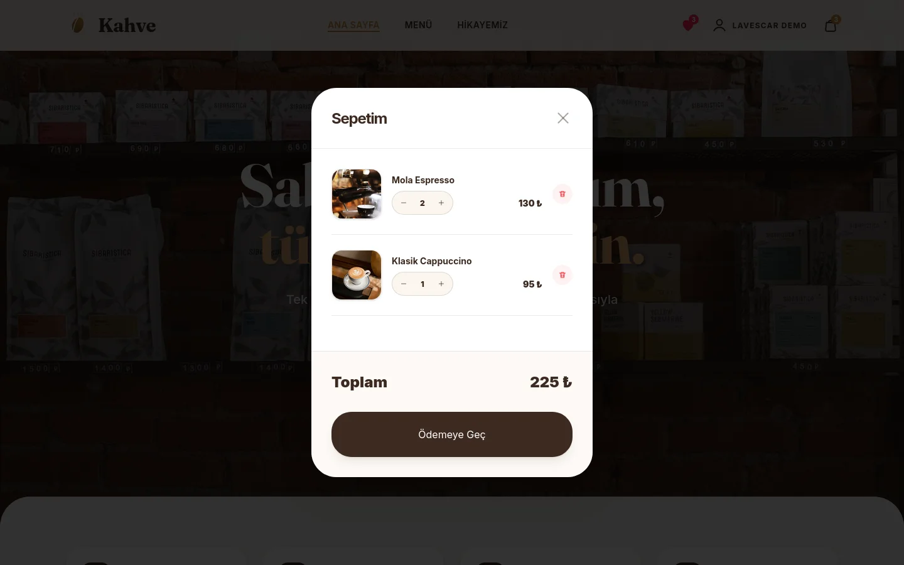
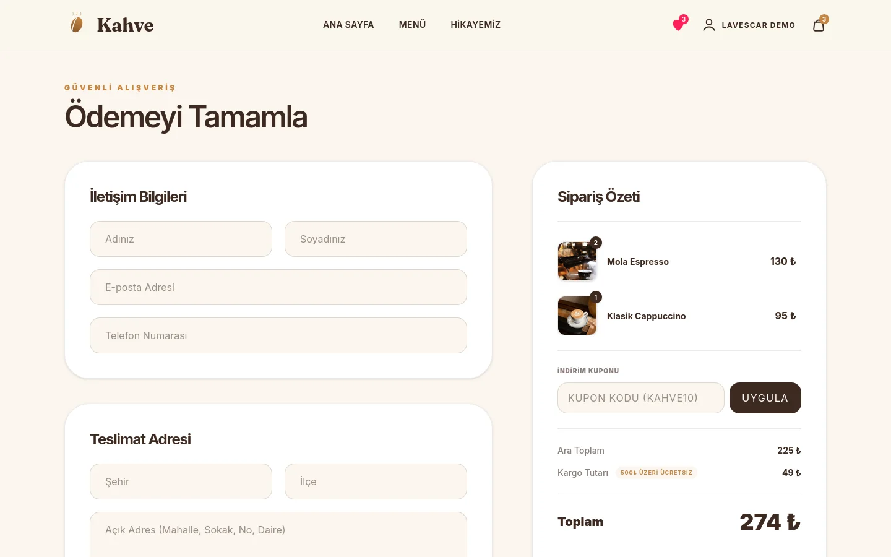
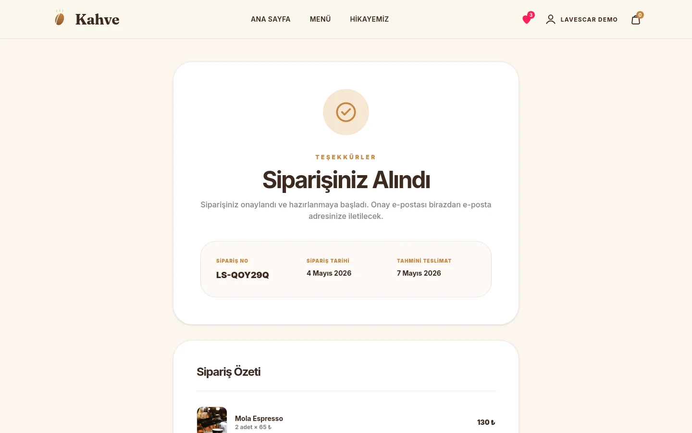
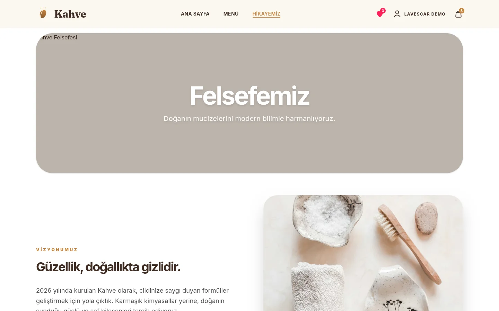
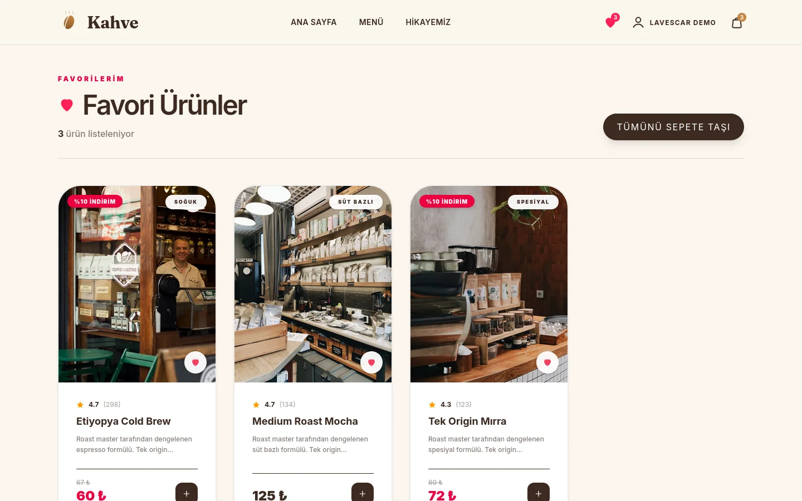

<div align="center">



# Kahve Roastery

**Tek-origin kahve butik storefront demosu** — Svelte 5 + Tailwind 4 + Vite. Çekirdek listesi, demleme rehberli ürün detayı, abonelik bazlı sepet, checkout, sipariş takibi ve müşteri profili.

[](#tech-stack)
[](https://kahve.lavescar.com.tr)
[](#license)

[**▸ Live demo**](https://kahve.lavescar.com.tr) · [**▸ Portfolyo**](https://lavescar.com.tr) · [**▸ Diğer demolar**](https://lavescar.com.tr/#projects)

</div>

---

<p align="center"></p>

## Genel bakış

Kahve, küçük kavurmacı butiklerinin bir hafta sonu kurabileceği boyutta tasarlanmış bir storefront referansıdır. Çekirdek katalog tek "single-origin" odaklı: aroma profilleri, demleme yöntemi tavsiyeleri, abonelik (haftalık/aylık) ve klasik tek-seferlik satın alma seçeneği. Tamamen browser-only çalışır; gerçek POS/sipariş yönetimine bağlanmaya hazırdır.

## Özellikler

- **Single-origin katalog** — menşe, işleme yöntemi, kavurma derecesi, tat notları
- **Demleme rehberli ürün detayı** — V60, French Press, espresso ayarları
- **Abonelik + tek seferlik** — sepete ekleme akışında seçim
- **Sepet paneli** — slide-out, miktar düzenleme, indirim kuponu
- **Checkout** — adres + kart formu, abonelik onayı
- **Sipariş takibi** — kavuruluyor → kargoda → teslim aşamaları
- **Hakkımızda** — kavurmacı + tedarikçi hikayesi
- **Wishlist** — favori çekirdekler
- **localStorage persistence** — sepet, abonelik, oturum tarayıcıda

## Tech stack

| Layer | Technology |
|---|---|
| Framework | Svelte 5 (rune-based reactivity) |
| Build | Vite 7 |
| Styling | Tailwind CSS 4 (`@tailwindcss/vite` plugin) |
| State | Module-scoped `$state()` stores + `localStorage` |
| Images | Unsplash (uzaktan) |
| Deploy | Cloudflare Pages |

## Ekran görüntüleri

<table>
  <tr>
    <td></td>
    <td></td>
  </tr>
  <tr>
    <td></td>
    <td></td>
  </tr>
  <tr>
    <td></td>
    <td></td>
  </tr>
  <tr>
    <td colspan="2"></td>
  </tr>
</table>

## Hızlı başlangıç

```bash
git clone https://github.com/Lavescar-dev/kahve.git
cd kahve

npm install
npm run dev          # → http://localhost:5173
```

Build:

```bash
npm run build        # → dist/
npm run preview      # built bundle önizleme
```

## Backend ekleme

Mevcut sürüm tamamen browser-only. Gerçek bir kavurmacıya bağlamak için:

- **Sipariş yönetimi** — server-side persistence (Postgres/SQLite)
- **Abonelik billing** — periyodik tahsilat (örn. iyzico, Stripe Türkiye)
- **Stok takibi** — kavurma planı + envanter eşiği
- **Müşteri portalı** — abonelik durumu, geçmiş siparişler

`src/stores/` katmanı izole; HTTP istemcisi swap'lemek kolaydır.

## Deploy

Cloudflare Pages için doğrudan repo bağlanır:

| Field | Value |
|---|---|
| Build command | `npm install && npm run build` |
| Build output directory | `dist` |
| Node version | `20` |

## License

MIT © 2026 Lavescar

> Ürün görselleri Unsplash'tan demo amaçlı yüklenir.

---

<sub>Built by **[Lavescar](https://lavescar.com.tr)** · [Portfolyo](https://lavescar.com.tr/#projects) · [efe@lavescar.com.tr](mailto:efe@lavescar.com.tr)</sub>
